# Container Image Vulnerability Scanner
Check out my Grafana dashboard [Grafana Dashboard](https://grafana.thakurprince.com).

## Table of Contents
1. [Project Overview](#project-overview)
2. [Project Goals](#project-goals)
3. [Features](#features)
4. [Tools & Technologies](#tools--technologies)
5. [Architecture](#architecture)
6. [Installation](#installation)
7. [Alert Manager and Grafana Setup](#alert-manager-and-grafana-setup)
8. [CI/CD Integration](#cicd-integration)
9. [Notifications](#notifications)
10. [Dashboard & Reporting](#dashboard--reporting)

---

## Project Overview
Brief introduction about why securing container images is critical, problems faced by DevOps teams, and the purpose of this project.

## Project Goals
- Automate vulnerability scanning of container images before production deployment.
- Integrate security checks seamlessly into CI/CD pipelines.
- Generate detailed reports and send real-time notifications.
- Provide a historical dashboard for vulnerability tracking.
- AI Recommendation For the CVE Fixes

## Features
- Automatic container image scanning
- CVE-based vulnerability detection
- Real-time notifications (Slack, Teams)
- CI/CD pipeline integration
- Historical vulnerability dashboard

## Tools & Technologies
- **Programming Languages:** Python, Bash  
- **Vulnerability Database:** CVE, using Trivy  
- **Notifications:** Email via SMTP
- **CI/CD Integration:** Jenkin
- **Monitoring & Dashboard:** Grafana  
- **Containerization:** Docker
- **AI Recommendation:** Gemini / OpenAI

## Architecture
High-level diagram or description showing how the scanner interacts with container images, CI/CD pipelines, and notification systems.

**Trivy Folder Structure**
The below is the folder structure of the code with the files to be added along with the docker compose for the Grafana and alert manahger

```
├── trivy/ # Core vulnerability scanning components
│ ├── scan.sh # Script to scan container images using Trivy
│ ├── report.py # Generates vulnerability reports from scan results
│ ├── email_template.py # Email template for vulnerability alerts
│ ├── ai_suggestion.py # AI-based remediation suggestions
│ ├── exceptions.txt # List of vulnerabilities to ignore/exceptions
│ ├── .trivyignore # Trivy ignore file for known vulnerabilities
│ └── trivy_jenkins_stage.txt  # Jenkins Code with ENV Variables, Stage Code and POST Action Code
│
├── alertmanager/ # Service to handle alerting and notifications, Automated Alerts and AI Recommendation
│ ├── app.py # Main application for alert Management and AI Recommendation
│ ├── Dockerfile # Docker setup for alertmanager
│ ├── requirements.txt # Python dependencies for alertmanager
│ └── docker-compose.yaml
│
├── grafana-dashboards/ # Pre-built dashboards for monitoring vulnerabilities
│ ├── Build - Dashboard.json
│ └── Trivy Project Security Dashboard.json
│
├── .gitignore # Git ignore file
└── README.md # Project documentation (this file)
```

## Installation
Step-by-step instructions to set up the project locally or in a server environment.

### 1. Prerequisites
Ensure the following infrastructure components are set up before integrating the scanner:
- **Jenkins Server**  
  - Must have **Trivy** installed and accessible in `$PATH`.  
  - Python 3.8+ available.  
  - Docker Installed
  - Enabled the `aws` CLI for connecting the ECR
  - Add the SMTP Email settings for sending the emails
- **PostgreSQL Database (CVE DB)**  
  - Dedicated instance for storing vulnerability data.  
- **Alert Manager Server**  
  - Separate service for sending notifications (Slack/Teams).  
- **Grafana & Prometheus Server**  
  - For visualizing vulnerability trends over time.  
- **Docker** on the Jenkins server (for building/pulling images to scan).

> **Note:** Python dependencies, database connection, and scan execution will be handled within the Jenkins pipeline. Your task here is to ensure the scanner code exists in your repository and the supporting infrastructure is available.

---

### 2. Install Trivy on the Jenkins Server
Install Trivy on the Jenkins build agent:

```
sudo apt-get update
sudo apt-get install -y wget apt-transport-https gnupg lsb-release

wget https://aquasecurity.github.io/trivy-repo/deb/public.key -O- | sudo apt-key add -
echo deb https://aquasecurity.github.io/trivy-repo/deb $(lsb_release -sc) main | sudo tee /etc/apt/sources.list.d/trivy.list

sudo apt-get update
sudo apt-get install -y trivy

# Verify installation
trivy --version
```

### 3. Setup the CVE Scanner Code in Your Repository

Download and place the `/trivy` folder inside the root of your project repository:

```
project-root/
│
├── trivy/
│   ├── scan.sh              # Entry point for running the scan
│   ├── report.py            # Parses scan results and stores them in DB
│   ├── email_template.py    # Generates notification emails
│   ├── ai_suggestion.py     # AI-driven fix recommendations
│   ├── exceptions.txt       # List of vulnerabilities to ignore
│   └── .trivyignore         # Ignore file for Trivy known issues
│
└── <your existing project files...>
```

**Add Exceptions for Known Vulnerabilities**

Add any approved or temporarily ignored CVEs to `exceptions.txt`: for eg.

```
CVE-2024-9143
CVE-2023-29383
CVE-2022-40897
```
These CVEs will be excluded from causing build failures in Jenkins, but will still be stored in the database for reference.

Commit and push these changes to your repository:
```
git add trivy
git commit -m "Add vulnerability scanning module with exceptions"
git push origin main
```

**Add .trivyignore for Noise Reduction**

Use the `.trivyignore` file to exclude low-severity or non-exploitable vulnerabilities that frequently appear in base images but do not pose a real risk in your environment.  

This helps:  
- Keep reports clean and focused on actionable vulnerabilities  
- Reduce unnecessary build failures due to harmless CVEs  
- Customize exclusions per your project needs  


## Alert Manager and Grafana Setup

The Alert Manager module provides automated **daily and weekly vulnerability alerts**, integrates with **Grafana dashboards**, and supports **AI-driven remediation suggestions** via Gemini or OpenAI.

**1. Prerequisites**

- **Docker & Docker Compose** installed on the server.
- **PostgreSQL** instance with CVE scan results.
- SMTP credentials for sending emails.
- API keys for Gemini/OpenAI (optional for AI suggestions).

**2. Setup with Docker Compose**

- The repository includes a `docker-compose.yaml` file that sets up:
    - **Grafana**: For dashboards and alert visualization.
    - **FastAPI Alert Service**: For generating daily/weekly alerts and AI-based remediation suggestions.
- Sensitive credentials (SMTP, DB credentials, API secrets) are stored in a .env file and loaded via Docker Compose.
- Ensure that your .env file is never committed to Git. It is specific to the server environment.

**3. Environment Variables**

Store all required secrets in a `.env` file on the server:

| Variable              | Description                             | Example                       |
| --------------------- | --------------------------------------- | ----------------------------- |
| `POSTGRES_HOST`       | PostgreSQL hostname                     | `localhost`                   |
| `POSTGRES_DB`         | PostgreSQL database name                | `cve_scanner`                 |
| `POSTGRES_USER`       | PostgreSQL username                     | `scanner_user`                |
| `POSTGRES_PASSWORD`   | PostgreSQL password                     | `supersecret`                 |
| `SMTP_SERVER`         | SMTP server for sending alerts          | `smtp.gmail.com`              |
| `SMTP_PORT`           | SMTP port                               | `587`                         |
| `SMTP_USER`           | SMTP username                           | `alerts@example.com`          |
| `SMTP_PASSWORD`       | SMTP password                           | `emailpassword`               |
| `WEBHOOK_API_SECRET`  | Secret for authenticating webhook calls | `mywebhooksecret`             |
| `GRAFANA_URL`         | Base URL of Grafana instance            | `https://grafana.example.com` |
| `BUILD_DASHBOARD_UID` | Grafana dashboard UID for build reports | `abcd1234efgh5678`            |
| `AI_API_KEY`          | Gemini/OpenAI API key (optional)        | `sk-xxxx`                     |


Docker Compose automatically injects these values into the containers.

**4. Configure Nginx for Domain Mapping**

- Install and configure Nginx on the Grafana/Alertmanager server.
- Set up reverse proxies for Grafana and Alertmanager with your domain:

> Use the public IP of the box that runs Grafana/Alertmanager/Nginx (sounds like your Azure VM `4.240.98.78`; if you’re using a different host, swap the IP below).

# 1) Cloudflare DNS

Cloudflare → **thakurprince.com → DNS**

* Add `A` record: **grafana** → **4.240.98.78**
* Add `A` record: **alerts** → **4.240.98.78**
* For first setup, set **Proxy status = DNS only (grey cloud)**. You can switch to orange “Proxied” after TLS works.
* Ensure your server’s firewall/Security Group allows **80** and **443**.

# 2) Install Nginx + Certbot on the server

```bash
sudo apt update
sudo apt install -y nginx certbot python3-certbot-nginx
```

```
server {
    listen 80;
    server_name grafana.example.com;

    location / {
        proxy_pass http://localhost:3000;
    }
}

server {
    listen 80;
    server_name alerts.example.com;

    location / {
        proxy_pass http://localhost:9093;
    }
}
```

Update DNS to point `grafana.example.com` and `alerts.example.com` to your server's IP.

**5. FastAPI Endpoints**

Once the container is running, the following endpoints are available:

- Test Email (GET): Verifies SMTP setup.

```
GET /email-test
```

- Daily Alert (POST): Sends an email with vulnerabilities from the last 24 hours.

```
POST /trigger-daily-alert
Header: api-secret=yourapisecret
```

- Weekly Alert (POST): Sends an email summary of the last 7 days.

```
POST /trigger-weekly-alert
Header: api-secret=yourapisecret
```

- AI Suggestions (POST): This API will be called from the Jenkins Stage

```
POST /generate-ai-suggestion
Header: api-secret=yourapisecret
Body:
{
  "build_id": 123,
  "ai_engine": "openai",
  "model": "gpt-4.1-nano"
}
```
```
FOR GEMINI VM test

curl -X POST "http://4.240.98.78:8000/generate-ai-suggestion"   -H "Content-Type: application/json"   -H "api-secret: yourapisecret"   -d '{
    "build_id": 1,
    "ai_engine": "gemini",
    "model": "gemini-2.0-flash"
  }'
```

**6. Integration with Grafana**

- **Connect Grafana to PostgreSQL**  
  - Add a new data source in Grafana and configure it to connect to your PostgreSQL instance that stores the CVE scan results.
  - Ensure the database user has read-only access to the relevant tables (`trivy_results`, `build_report`, etc.).

- **Import Prebuilt Dashboard**  
  - The repository includes a prebuilt dashboard JSON file under `grafana-dashboard/`.  
  - To import:
    1. Navigate to **Grafana → Dashboards → Import**.
    2. Upload the `grafana-dashboard/Build - Dashboard.json` file and also `Trivy Project Security Dashboard.json`. Totally 2 dashboard
    3. Select your PostgreSQL data source when prompted.
  - This dashboard provides:
    - Vulnerability trends (Critical, High, Medium counts over time)
    - Build-specific vulnerability breakdowns
    - Links to detailed reports and AI remediation suggestions

- **Configure Alert Rules in Grafana**  
  - Create alert rules to monitor:
    - Any **new Critical vulnerabilities** in the last 24 hours.
    - Any **increase in High vulnerabilities** compared to the previous build.
  - Configure these alerts to trigger **webhooks** that call:
    - `/trigger-daily-alert`
    - `/trigger-weekly-alert`
  - Example webhook URL:
    ```bash
    http://alerts.example.com/trigger-daily-alert
    ```

- **Environment Variables for Email Reports**  
  - Use the following environment variables so email alerts contain direct links to Grafana:
    - `GRAFANA_URL` → Base URL of Grafana instance (e.g., `https://grafana.example.com`)
    - `BUILD_DASHBOARD_UID` → Unique ID of the imported dashboard (visible in Grafana dashboard settings)
  - Example email snippet:
    ```
    View full vulnerability details at:
    ${GRAFANA_URL}/d/${BUILD_DASHBOARD_UID}/build-security-dashboard?var-build_id=123
    ```

**7. Schedule API Calls via Cron**

Add the FastAPI alert endpoints to a cron job to run daily and weekly at 10:00 AM:

```
0 10 * * * curl -X POST http://alerts.example.com/trigger-daily-alert
0 10 * * 1 curl -X POST http://alerts.example.com/trigger-weekly-alert
```

- This is configured on the server where the Alert Manager is running.
- Useful as a fallback if **Grafana Alerting** is not configured or fails.

**8. Alternative to CRON: Use AWS EventBridge (Recommended for Cloud Deployments)**  
- AWS EventBridge can be used to trigger these endpoints on a schedule without relying on server-side cron jobs.
- Example EventBridge Rule:
  - **Schedule Expression:** `cron(0 10 * * ? *)` (daily at 10:00 AM UTC)
  - **Target:** API Gateway / Lambda / Direct FastAPI endpoint.
- Benefits:
  - Centralized management of schedules.
  - Reliable execution even if the server hosting Alert Manager is down.

**8. Key Features**

- Automated Vulnerability Alerts: Daily and weekly notifications via email.
- Grafana Integration: Clickable links to detailed dashboards.
- AI Remediation Suggestions: Optional use of Gemini/OpenAI for auto-generated fixes.
- Secure Access: All endpoints require a `WEBHOOK_API_SECRET`.
- Secrets managed via `.env` file for secure deployments.

## CI/CD Integration

This repository integrates Trivy-based image scanning and AI-driven remediation into Jenkins pipelines. The items to integrated are mentioned on this file `trivy/trivy_jenkins_code.txt`.

**Key Environment Variables**

These are configured in the Jenkins pipeline under the `environment` block:

| Variable               | Source             | Description                                         |
| ---------------------- | ------------------ | --------------------------------------------------- |
| `CVE_DB_HOST`          | Jenkins Secret     | Hostname/IP of PostgreSQL database for scan results |
| `CVE_DB_USERNAME`      | Jenkins Secret     | Database username                                   |
| `CVE_DB_PASSWORD`      | Jenkins Secret     | Database password                                   |
| `CVE_DB_NAME`          | Jenkins Secret     | Database name where scan results are stored         |
| `ALERT_MANAGER_URL`    | Hardcoded/ENV      | FastAPI Alert Manager endpoint                      |
| `ALERT_MANAGER_SECRET` | Jenkins Secret/ENV | API secret for Alert Manager authentication         |

**Pipeline Stages for Security Scanning**

- **1. Scan the Docker Image**
    - Runs `trivy/scan.sh` against the built image.
    - Stores results in `PostgreSQL`.
    - Extracts a `build_id` for further processing.

    ```
    stage("Scan the Image") {
        steps {
            script {
                sh "chmod +x ./trivy/scan.sh"

                def fullOutput = sh(
                    script: """
                        ./trivy/scan.sh \
                            "${ECR_REPO_PATH}" \
                            "${IMAGE_TAG}" \
                            "${ECR_REPO_NAME}" \
                            "${GIT_BRANCH}" \
                            "${env.BUILD_URL}" \
                            "${CVE_DB_HOST}" \
                            "${CVE_DB_USERNAME}" \
                            "${CVE_DB_PASSWORD}" \
                            "${CVE_DB_NAME}" || true
                    """,
                    returnStdout: true
                ).trim()

                env.FULL_RESULT = fullOutput

                def refBuildId = (fullOutput =~ /build_id:\\s+([0-9]+)/)
                env.REF_BUILD_ID = (refBuildId ? refBuildId[0][1] : "").toString()
            }
        }
    }
    ```
    > 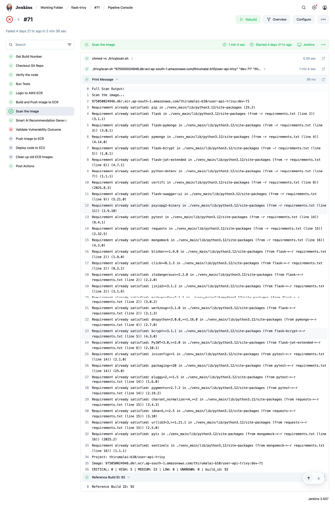

- **2. Generate AI-based Remediation Suggestions**
    - Calls the FastAPI Alert Manager to generate actionable fixes.
    ```
    stage("Smart AI Recommendation Generate") {
        when {
            expression { return env.REF_BUILD_ID?.trim() }
        }
        steps {
            sh """
                python3 trivy/ai_suggestion.py \
                    ${env.REF_BUILD_ID} \
                    ${ALERT_MANAGER_URL} \
                    ${ALERT_MANAGER_SECRET}
            """
        }
    }
    ```
    > 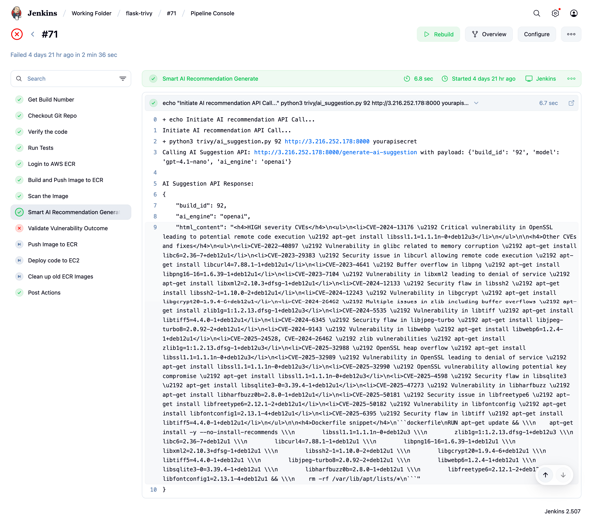

- **3. Validate Scan Results & Fail Build if Needed**
    - Parses Trivy results.
    - Fails pipeline if Critical or High vulnerabilities are found.
    - The CVE's from the `exceptions.txt` file will be excluded on the preivous stage so the count taken for validation is only new CRITICAL and HIGH counts.
    ```
    stage("Validate Vulnerability Outcome") {
        steps {
            script {
                def result = env.FULL_RESULT.readLines().findAll {
                    it.startsWith("Project:") || it.startsWith("Image:") || 
                    it.startsWith("CRITICAL:") || it.startsWith("HIGH:")
                }.join("\n")

                env.SCAN_RESULT = sh(
                    script: "python3 trivy/email_template.py reports/scan-report-${IMAGE_TAG}.json ${env.BUILD_URL}",
                    returnStdout: true
                )

                def criticalCount = ((result =~ /CRITICAL:\s+([0-9]+)/) ? (result =~ /CRITICAL:\s+([0-9]+)/)[0][1].toInteger() : 0)
                def highCount = ((result =~ /HIGH:\s+([0-9]+)/) ? (result =~ /HIGH:\s+([0-9]+)/)[0][1].toInteger() : 0)

                if (criticalCount > 0 || highCount > 0) {
                    error("❌ Found vulnerabilities (CRITICAL: ${criticalCount}, HIGH: ${highCount}) – failing build!")
                }
            }
        }
    }
    ```
    > 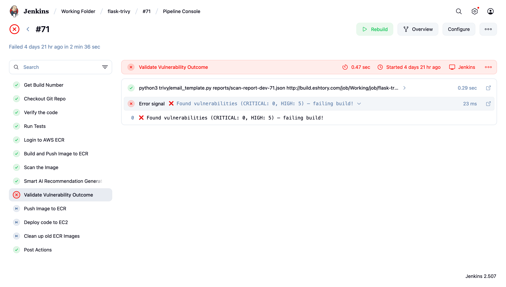

- **4. Notifications**
    - Sends HTML emails on **success** or **failure**, including:
        - **Scan summary** with counts of CRITICAL, HIGH, MEDIUM, LOW, and EXCEPTION vulnerabilities.
        - **Build details** with direct links to Jenkins build logs and Grafana dashboards.
    - **Email Template**:
        - Located in `trivy/email_template.py`.
        - Dynamically formats results into a clean HTML table.
        - Adds color highlights (e.g., **red for CRITICAL/HIGH**, **green for success**).
    - **Success Emails**:
        - Include the scan summary and a confirmation message that no blocking vulnerabilities were found.
    - **Failure Emails**:
        - Include a detailed list of vulnerabilities and recommend immediate action.
    - **Delivery**:
        - Emails are sent using SMTP credentials stored in the Jenkins server environment variables (`SMTP_HOST`, `SMTP_USER`, `SMTP_PASS`).

> **Note:** 
> - The deployment stage (EC2, EKS, etc.) is **modular** and can be replaced per your infrastructure needs. For Demo purpose
> - The **Trivy scanning logic remains universal** across deployment targets.

## Email Output Samples

This section provides screenshots of the email alerts generated by the system and where they are triggered:

- **Success Email (CI/CD Pipeline)**:
  - **Trigger Location:** Jenkins pipeline (`post { success { ... } }`)
  - Triggered when the pipeline completes successfully with no CRITICAL/HIGH vulnerabilities.
  - Contains build ID, scan summary, and links to Jenkins logs and the Grafana dashboard.
  > 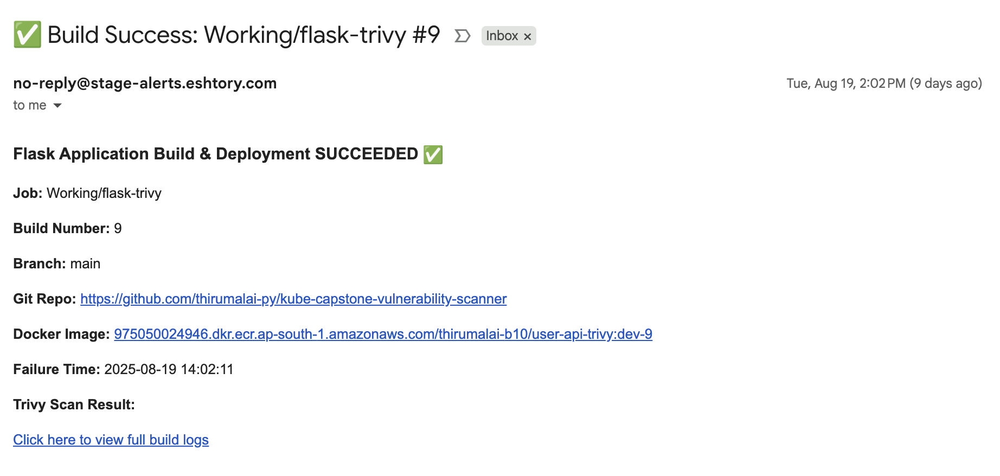

- **Failure Email (CI/CD Pipeline)**:
  - **Trigger Location:** Jenkins pipeline (`post { failure { ... } }`)
  - Triggered when CRITICAL/HIGH vulnerabilities are found.
  - Includes vulnerability details, recommended fixes, and direct links to Grafana and detailed reports.
  - Uses `trivy/email_template.py` for formatting results in an HTML table with severity-based highlights.
  > 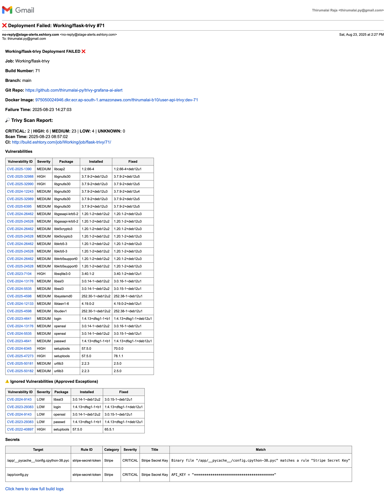

- **Daily Alert Email**:
  - **Trigger Location:** Server Cron Job or AWS EventBridge (`0 10 * * *`)
  - Sent at 10:00 AM daily.
  - Summarizes vulnerabilities detected in the last 24 hours.
  - Contains links to the Grafana dashboard and detailed reports.
  > 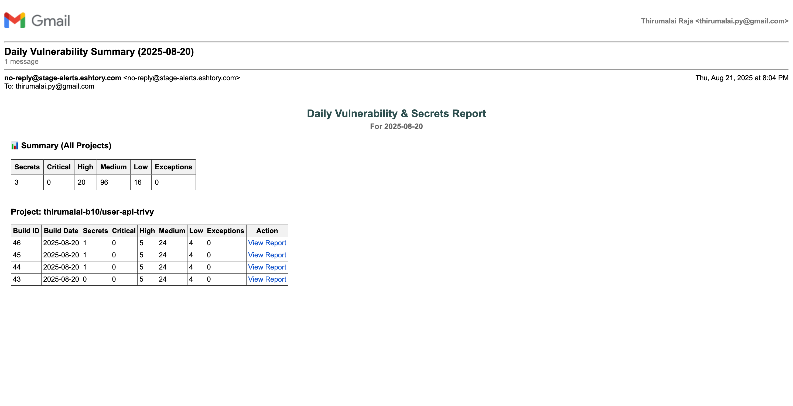

- **Weekly Alert Email**:
  - **Trigger Location:** Server Cron Job or AWS EventBridge (`0 10 * * 1`)
  - Sent every Monday at 10:00 AM.
  - Provides a weekly overview of vulnerabilities, trends, and unresolved CRITICAL/HIGH issues.
  - Highlights key changes compared to the previous week.
  > 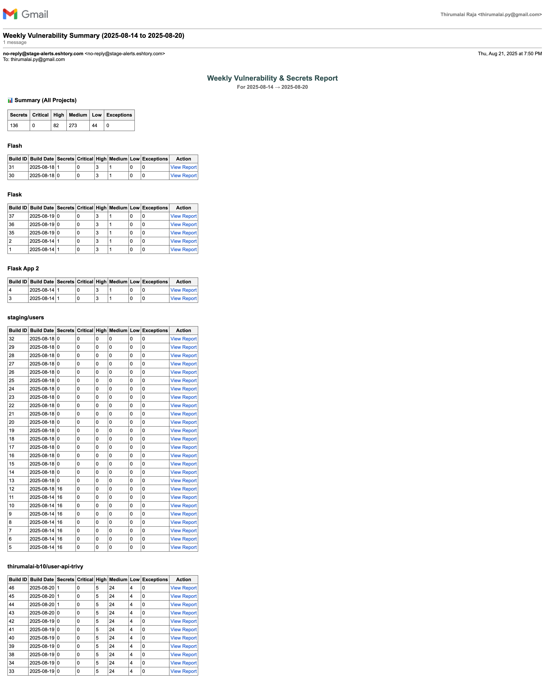

- **AI Recommendation Email**:
  - **Trigger Location:** Jenkins pipeline (post-scan step) or manual invocation via FastAPI endpoint (`/send-ai-recommendations`)
  - Provides actionable recommendations for addressing high-priority vulnerabilities.
  - Includes explanations, remediation steps, and prioritization guidance.
  > 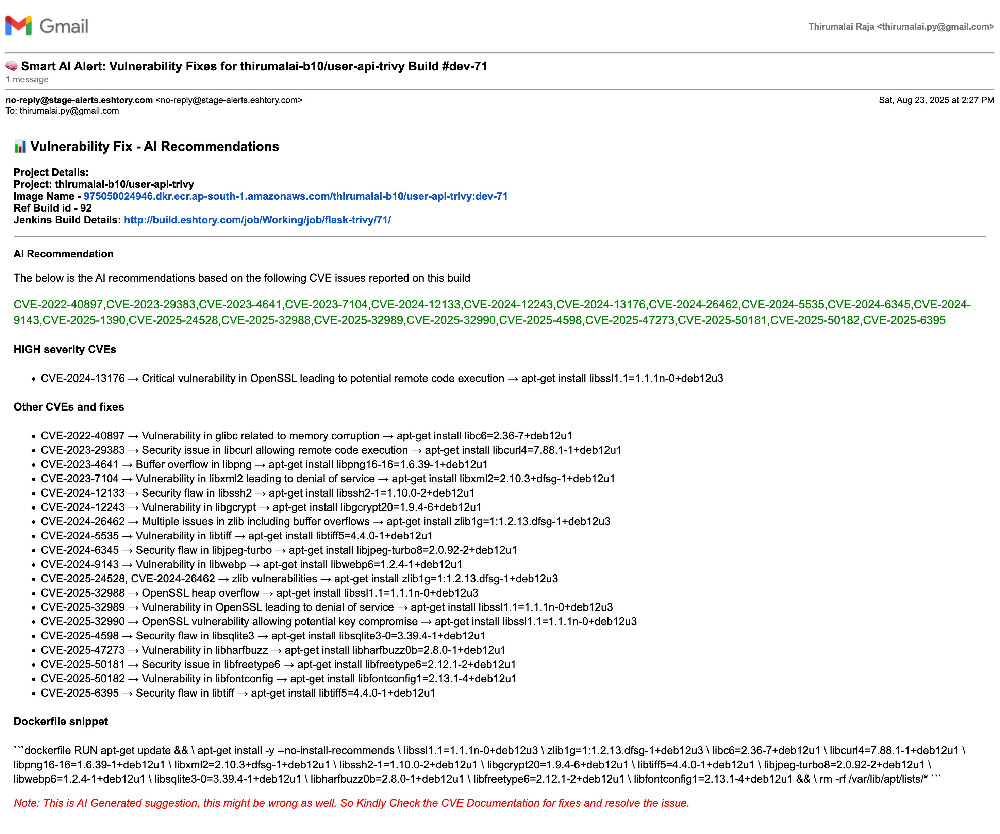


## Dashboard & Reporting
This project integrates with Grafana to provide rich visual dashboards for vulnerability tracking, historical analysis, and build insights. Below are the steps to set up the underlying database and import the dashboards:
#### Step 1. Setup PostgreSQL Database

- **Log in to Grafana**:  
  Go to `http://<your-domain>/grafana` and log in with your admin credentials.  

- **Navigate to Data Sources**:  
  - Click on the **Gear (⚙️) icon** in the left sidebar.  
  - Select **Data Sources** → **Add data source**.  

- **Select PostgreSQL**:  
  - Search for **PostgreSQL** in the list of available data sources.  
  - Click **Select**.  
  > 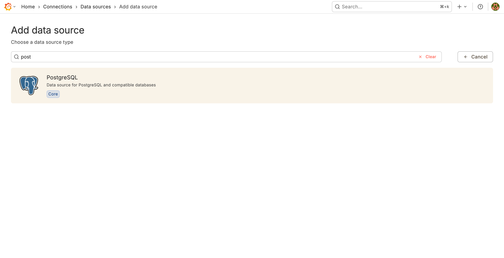

- **Configure Connection Details**:  
  Fill in the following details based on your existing DB:
  - **Host**: `<your-db-host>:5432`
  - **Database**: `trivy_reports`
  - **User**: `<your-db-user>`
  - **Password**: `<your-db-password>`
  - **SSL Mode**: Set to `disable` (or `require` if using SSL).  
  > 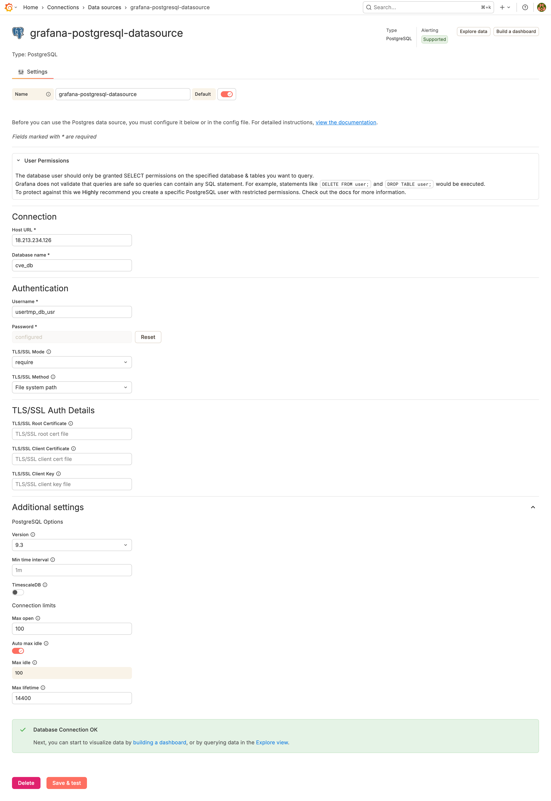

- **Set Time Zone and Options**:
  - **Time column type**: `timestamp without time zone`
  - **Version**: Select your PostgreSQL version (auto-detect works for most setups).
  - **Min time interval**: Set to `1m`.

- **Save & Test**:
  - Click **Save & Test**.
  - Ensure Grafana confirms a successful connection

---

#### Step 2. Import the Trivy Project Security Dashboard

- **Go to Dashboard Import in Grafana**:
  - Click on the **Plus (+)** icon in the left sidebar.
  - Select **Import**.  
  > 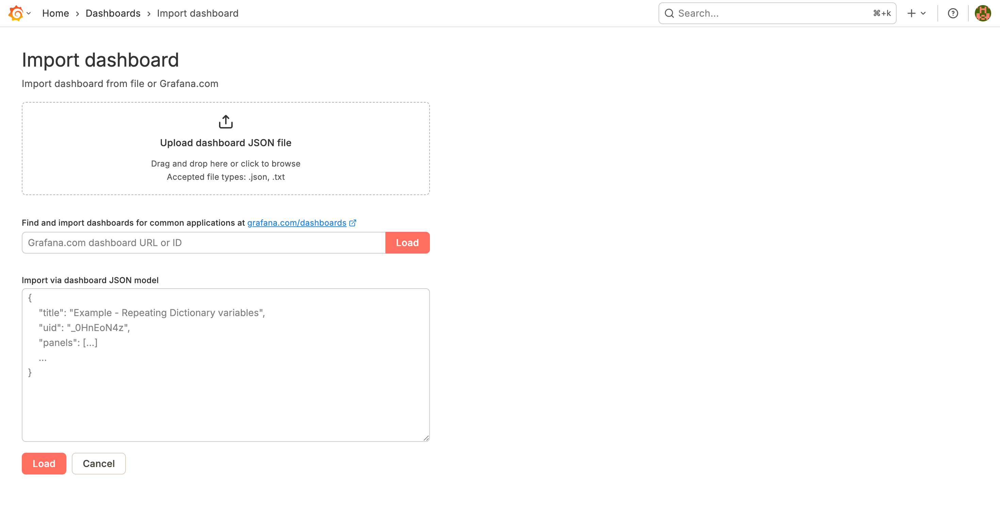

- **Upload or Paste Dashboard JSON**:
  - Use the `grafana-dashboard/Trivy-Project-Security-Dashboard.json` file from the repository.
  - Either **Upload JSON file** or **Paste JSON** content into the import screen.  
  > 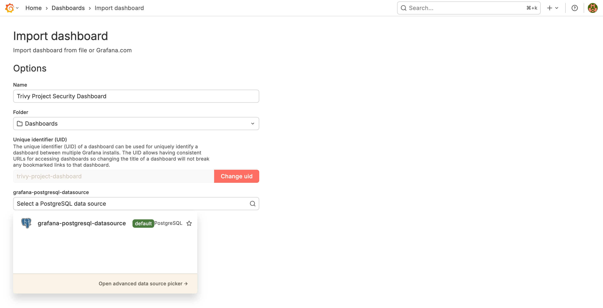

- **Select Data Source**:
  - When prompted, choose the PostgreSQL data source configured in **Step 1**

- **Click Import**:
  - The `Trivy Project Security Dashboard` will now appear in your Grafana dashboard list.  

- **Verify Dashboard**:
  - Open the dashboard to ensure data is populating correctly:
    - **Project-wise Vulnerability Counts**
    - **Severity Breakdown (Critical, High, Medium, Low)**
    - **Historical Trends**  
    > 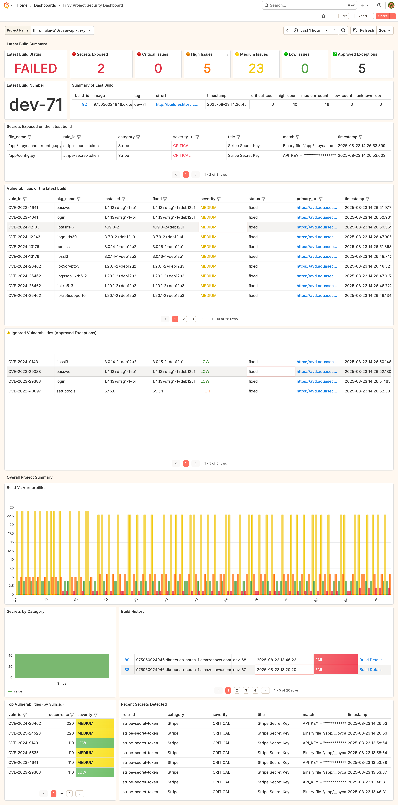

---

#### Step 3. Import the Build Dashboard (Child Dashboard)

- **Navigate to Import Dashboard in Grafana**:
  - Click the **Plus (+)** icon on the left sidebar.
  - Select **Import**.  

- **Upload or Paste Dashboard JSON**:
  - Use the `grafana-dashboard/Build-Dashboard.json` file from the repository.
  - Either **Upload JSON file** or **Paste JSON** content into the import screen.  

- **Link to PostgreSQL Data Source**:
  - When prompted, select the same PostgreSQL data source configured in **Step 1**.

- **Click Import**:
  - The `Build Dashboard` will now be available in your Grafana dashboard list.  
  > 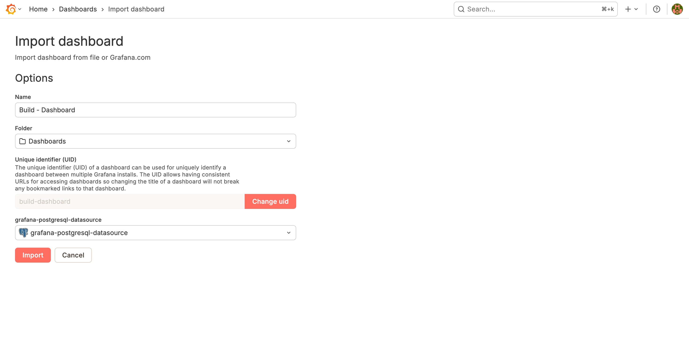

- **Verify Child Dashboard Linking**:
  - Open the `Trivy Project Security Dashboard`.
  - Confirm build-specific panels link to the `Build Dashboard`.
  - Test navigation by clicking on a project to see build-level vulnerability details.  
  > 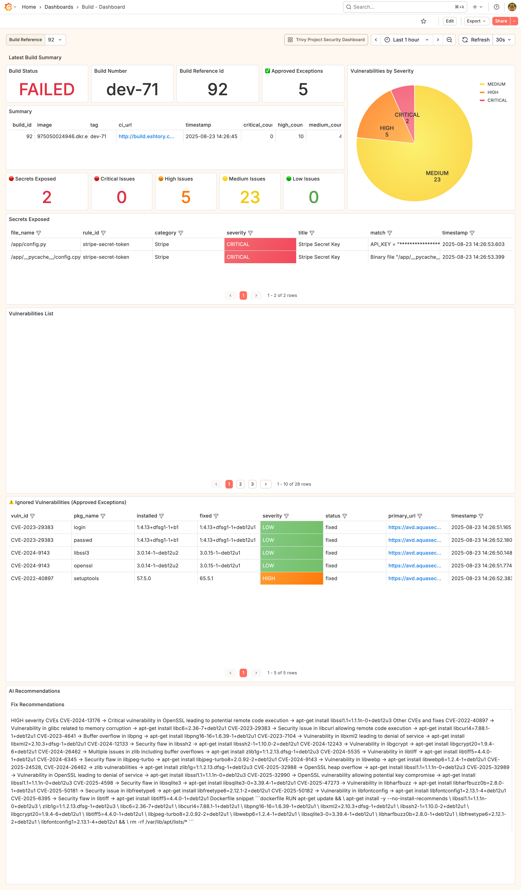

- **List of Dashboards**:
  - Now we have 2 dashboards `Trivy Project Security Dashboard` and `Build Dashboard`
  - The build dashboard is linked from the `Trivy Project Security Dashboard` 
  > 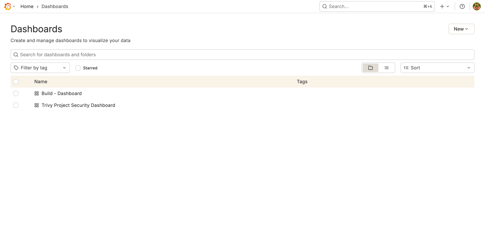


